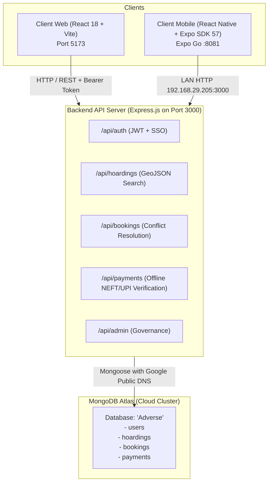
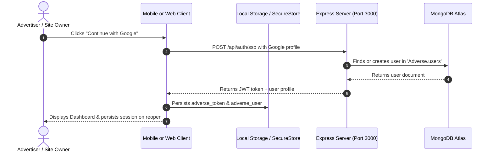
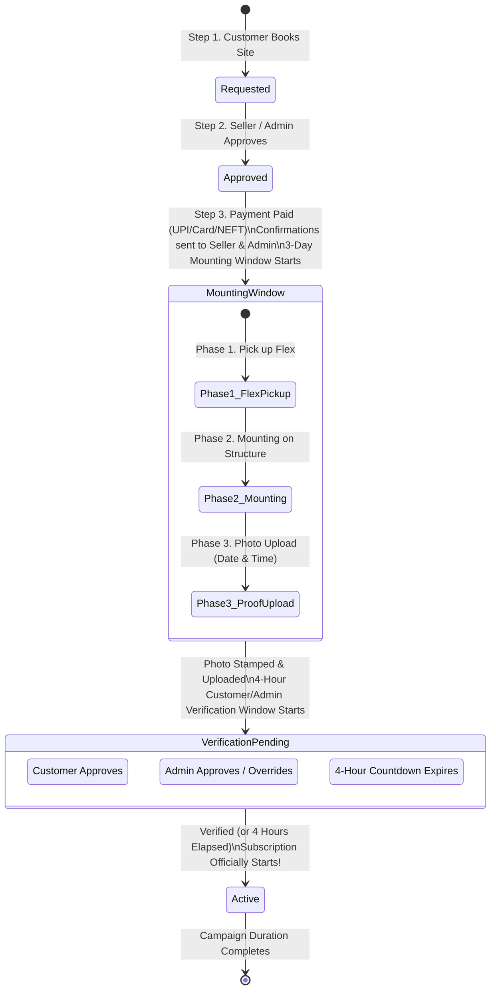
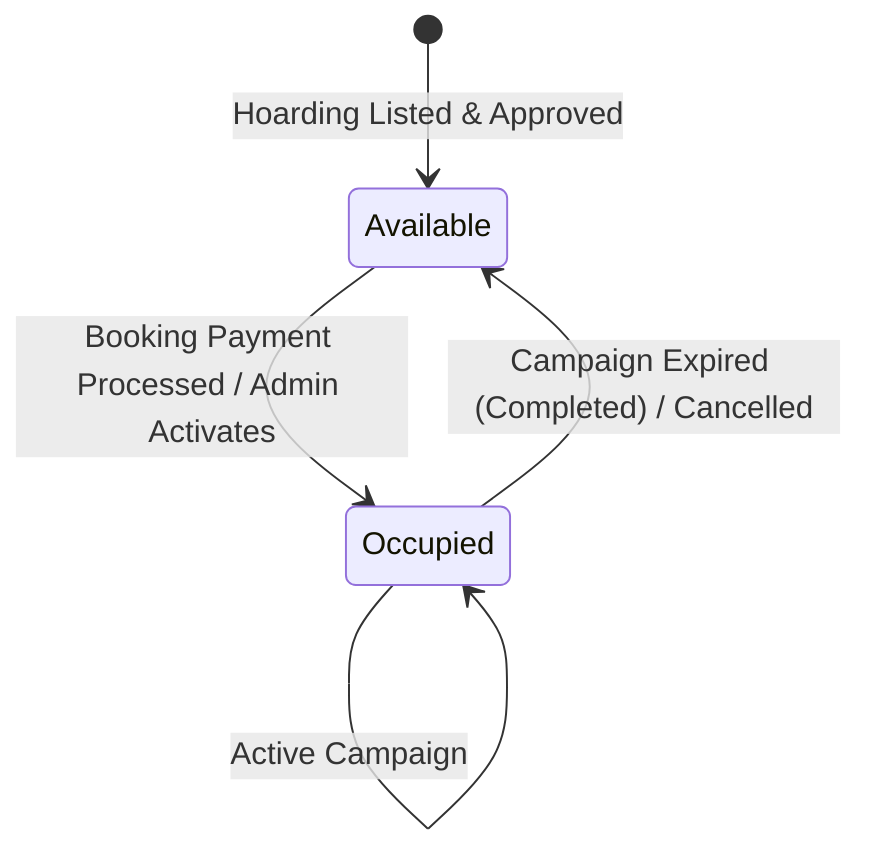

# 📚 ADVERSE Platform — Complete Architecture & Codebase Guide

Welcome to the comprehensive architecture and developer guide for **ADVERSE** — the digital marketplace for Out-Of-Home (OOH) billboard and hoarding rentals across West Bengal.

This document is designed to teach you the system architecture, file structure, design decisions, and core workflows from scratch.

---

## Table of Contents
1. [High-Level Architecture](#1-high-level-architecture)
2. [Monorepo Directory Structure](#2-monorepo-directory-structure)
3. [Backend Deep Dive (`server`)](#3-backend-deep-dive-server)
   - [Database Connection & DNS SRV Engine](#database-connection--dns-srv-engine)
   - [Data Models & Mongoose Schemas](#data-models--mongoose-schemas)
   - [Authentication & Single Sign-On (SSO)](#authentication--single-sign-on-sso)
   - [Business Logic & Controllers](#business-logic--controllers)
4. [Web Client Deep Dive (`client-web`)](#4-web-client-deep-dive-client-web)
   - [Tech Stack & Routing](#tech-stack--routing)
   - [Authentication State (`AuthContext.jsx`)](#authentication-state-authcontextjsx)
   - [Interactive Maps (`HoardingMap.jsx`)](#interactive-maps-hoardingmapjsx)
   - [Pages & Workflows](#pages--workflows)
5. [Mobile Client Deep Dive (`client-mobile`)](#5-mobile-client-deep-dive-client-mobile)
   - [Expo SDK 57 & React Native 0.86](#expo-sdk-57--react-native-086)
   - [Persistent Storage Adapter (`storage.js`)](#persistent-storage-adapter-storagejs)
   - [Safe Area Insets & System Navigation](#safe-area-insets--system-navigation)
   - [Live GPS "Near Me" Geolocation](#live-gps-near-me-geolocation)
   - [Mobile SSO & Bottom Sheet](#mobile-sso--bottom-sheet)
6. [Cross-Platform Synchronization Flow](#6-cross-platform-synchronization-flow)
7. [Running & Testing the Entire Stack](#7-running--testing-the-entire-stack)
8. [Mounting, Installation & Verification Pipeline](#8-mounting-installation--verification-pipeline)
   - [The Complete 5-Step Order Lifecycle](#the-complete-5-step-order-lifecycle)
   - [The 3-Phase Mounting Workflow](#the-3-phase-mounting-workflow)
   - [Collapsible Dropdown UI Architecture (Web & Mobile)](#collapsible-dropdown-ui-architecture-web--mobile)
   - [Super Admin Window Governance & Overrides](#super-admin-window-governance--overrides)
   - [Configuring Default Window Durations in Code](#configuring-default-window-durations-in-code)
9. [Hoarding Inventory & Booking Status Synchronization](#9-hoarding-inventory--booking-status-synchronization)
   - [Hoarding Availability State Machine](#hoarding-availability-state-machine)
   - [Automatic Release on Campaign Expiration & Completion](#automatic-release-on-campaign-expiration--completion)
   - [Cross-Platform Status Normalization](#cross-platform-status-normalization)
10. [Client Role Boundaries & Hoarding Enlistment Protection](#10-client-role-boundaries--hoarding-enlistment-protection)
   - [Role Privilege Matrix](#role-privilege-matrix)
   - [Multi-Tier Guard Architecture](#multi-tier-guard-architecture)

---

## 1. High-Level Architecture

The platform operates on a three-tier architecture connecting Web, Mobile, and Cloud Backend:



---

## 2. Monorepo Directory Structure

```
Adverse/
├── server/                       # Node.js / Express API
│   ├── .env                      # Environment configurations (PORT, MONGO_URI, JWT)
│   ├── src/
│   │   ├── app.js                # Express app configuration & middleware pipeline
│   │   ├── server.js             # Server entry point & autoSeed trigger
│   │   ├── config/
│   │   │   ├── env.js            # Environment variables parser
│   │   │   ├── db.js             # Mongoose connection with public DNS SRV resolvers
│   │   │   └── autoSeed.js       # Auto-seeds default users & 6 prime Bengal hoardings
│   │   ├── middlewares/
│   │   │   ├── auth.middleware.js # Multi-role token verification & resilient lookups
│   │   │   └── error.middleware.js# Centralized error handler & status mapper
│   │   ├── models/
│   │   │   ├── User.js           # Users (Customer, Seller, Admin, SSO accounts)
│   │   │   ├── Hoarding.js       # Billboards with 2dsphere GeoJSON spatial coordinates
│   │   │   ├── Booking.js        # Date-range reservations & state transitions
│   │   │   └── Payment.js        # Offline UTR/Cheque records & verification timestamps
│   │   └── modules/
│   │       ├── auth/             # Login, register, SSO, profile routes
│   │       ├── hoardings/        # Geospatial radial discovery & filters
│   │       ├── bookings/         # Availability engine & calendar conflict prevention
│   │       ├── payments/         # Offline payment proof submit & owner approval
│   │       └── admin/            # Platform metrics & site moderation
│
├── client-web/                   # React 18 Single Page App (SPA)
│   ├── index.html                # HTML entry point
│   ├── vite.config.js            # Vite build tool with /api proxy to localhost:3000
│   ├── tailwind.config.js        # Tailwind CSS utility theme
│   └── src/
│       ├── App.jsx               # React Router routes & ProtectedRoute gates
│       ├── services/api.js       # Central Axios client with token interceptors
│       ├── context/AuthContext.jsx # Global user authentication state
│       ├── components/
│       │   ├── Navbar.jsx        # Navigation header with role badges
│       │   ├── Footer.jsx        # Footer with regional hub links
│       │   ├── HoardingCard.jsx  # Reusable billboard card with price & specs
│       │   ├── HoardingMap.jsx   # Interactive Leaflet map (React 18 compatible)
│       │   ├── GoogleSSOModal.jsx# Branded Google OAuth account selector
│       │   └── ErrorBoundary.jsx # React component crash protection
│       └── pages/
│           ├── HomePage.jsx      # Hero section, quick city filters, featured hoardings
│           ├── SearchResultsPage.jsx # Full-screen split view with map + filter panel
│           ├── HoardingDetailPage.jsx# Detailed specs, photo gallery, booking form
│           ├── LoginPage.jsx     # Email & Google SSO login
│           ├── RegisterPage.jsx  # Advertiser vs Media Owner registration
│           ├── seller/           # Media owner dashboard (inventory & payments)
│           ├── customer/         # Advertiser dashboard (campaigns & booking slips)
│           └── admin/            # Super Admin metrics & hoarding approval desk
│
└── client-mobile/                # React Native Expo Mobile App
    ├── app.json                  # Expo app metadata, bundle identifiers & permissions
    ├── App.js                    # Navigation setup (BottomTabs + NativeStack + RootNavigator)
    └── src/
        ├── api/client.js         # Mobile Axios client pointing to LAN IP 192.168.29.205
        ├── utils/storage.js      # Resilient storage adapter (expo-secure-store + async-storage)
        ├── context/AuthContext.js# Mobile auth state with automatic storage rehydration
        └── screens/
            ├── HomeScreen.js     # Discover feed, Live GPS "Near Me" search with radius pills
            ├── HoardingDetailScreen.js # Billboard specs, booking button with bottom safe inset
            ├── MyBookingsScreen.js# Advertiser booking history & payment status
            ├── SellerDashboardScreen.js # Media owner desk for verifying payments
            └── LoginScreen.js    # Sign in, Sign up, and Google SSO bottom sheet
```

---

## 3. Backend Deep Dive (`server`)

### Database Connection & DNS SRV Engine
In [`server/src/config/db.js`](file:///d:/Adverse/server/src/config/db.js):
* **The Challenge**: MongoDB Atlas connection strings use `mongodb+srv://`. On Windows or certain ISPs, local DNS resolvers frequently refuse SRV queries (`querySrv ECONNREFUSED`), which causes the app to fail connecting to the cloud cluster.
* **The Solution**: Before connecting, `db.js` explicitly configures Node.js's DNS subsystem to use Google Public DNS (`8.8.8.8`, `8.8.4.4`) and Cloudflare DNS (`1.1.1.1`):
  ```javascript
  if (MONGO_URI && MONGO_URI.startsWith('mongodb+srv://')) {
    dns.setServers(['8.8.8.8', '8.8.4.4', '1.1.1.1']);
  }
  ```
* **Fallback Protection**: If Atlas is ever unreachable (e.g., completely offline), it seamlessly spins up an embedded in-memory database (`mongodb-memory-server`) to keep development running smoothly.

### Data Models & Mongoose Schemas

#### 1. User Model ([`User.js`](file:///d:/Adverse/server/src/models/User.js))
* **Three Roles**:
  * `customer`: Advertisers looking to book sites.
  * `seller`: Media owners enlisting billboards (requires admin approval before publishing).
  * `admin`: Platform moderators.
* **Sparse Indexing**:
  * `phone` is marked `{ sparse: true, default: undefined }`. When users register via SSO or don't provide a phone, MongoDB omits the field, preventing duplicate key collisions on empty strings.
* **Conditional Passwords**:
  * `passwordHash` is only required when `!this.ssoProvider`, allowing SSO users to exist without dummy passwords.
* **Resilient JWT Generation**:
  * `getSignedJwtToken()` signs the user ID, role, email, and SSO metadata with a 30-day expiration (`JWT_EXPIRES_IN=30d`).

#### 2. Hoarding Model ([`Hoarding.js`](file:///d:/Adverse/server/src/models/Hoarding.js))
* **Geospatial GeoJSON**:
  ```javascript
  geo: {
    type: { type: String, enum: ['Point'], default: 'Point' },
    coordinates: [Number] // [longitude, latitude] (GeoJSON format!)
  }
  ```
  Indexed with `HoardingSchema.index({ 'location.geo': '2dsphere' })` to enable high-speed radial search queries (`$nearSphere` / `$geoWithin`).
* **Attributes**: Dimensions (width × height in feet), lighting type (`Frontlit`, `Backlit`, `Digital/LED`, `Unlit`), hoarding type (`Billboard`, `Unipole`, `Gantry`, `Kiosk`), and estimated mounting/printing charges.

#### 3. Booking Model ([`Booking.js`](file:///d:/Adverse/server/src/models/Booking.js))
* Tracks rental date ranges (`startDate` to `endDate`).
* Lifecycle statuses: `requested` ➔ `active` ➔ `completed` (or `cancelled`).
* **Overlap Conflict Guard**: When a booking is submitted, the backend verifies that no active/confirmed booking exists for that hoarding during the requested dates:
  ```javascript
  {
    hoardingId,
    bookingStatus: { $in: ['active', 'confirmed'] },
    startDate: { $lte: requestedEndDate },
    endDate: { $gte: requestedStartDate }
  }
  ```

#### 4. Payment Model ([`Payment.js`](file:///d:/Adverse/server/src/models/Payment.js))
* Handles both offline and online modes:
  * `offlineDetails`: Records Bank Name, Cheque Number, or NEFT/UPI Transaction Reference (UTR).
  * `verifiedBy` & `verifiedAt`: Stores the seller's confirmation timestamp.

---

### Authentication & Single Sign-On (SSO)

#### Registration Uniqueness Check ([`auth.controller.js`](file:///d:/Adverse/server/src/modules/auth/auth.controller.js))
To prevent false "account exists" errors:
1. Validates and queries `email` first:
   If found, returns: `"An account with this email address already exists. Please sign in instead."`
2. Validates and queries `phone` **only if a valid string is provided**:
   If found, returns: `"An account with this phone number already exists. Please use a different phone number."`
3. Stores `phone: cleanPhone || undefined` so empty phone numbers never collide.

#### Resilient Token Verification ([`auth.middleware.js`](file:///d:/Adverse/server/src/middlewares/auth.middleware.js))
```javascript
const decoded = jwt.verify(token, JWT_SECRET);
let user = null;
if (decoded.id) {
  user = await User.findById(decoded.id).select('-passwordHash');
}
// Resilient fallback if server was restarted with new in-memory IDs
if (!user && decoded.email) {
  user = await User.findOne({ email: decoded.email.toLowerCase() }).select('-passwordHash');
}
```

#### SSO Endpoint (`POST /api/auth/sso`)
* Accepts `{ provider, ssoId, email, name, avatar, role, companyDetails }`.
* If user exists, links SSO credentials and generates token.
* If user is new, provisions account with role selection, sets status, and returns signed JWT.

---

## 4. Web Client Deep Dive (`client-web`)

### Tech Stack & Routing
* **Vite + React 18**: High-speed build tool and hot module replacement.
* **Tailwind CSS**: Utility-first styling.
* **React Router v6**: Client-side page navigation.
* **Axios**: Configured with request/response interceptors in `services/api.js`.

### Authentication State (`AuthContext.jsx`)
* Rehydrates `token` from `localStorage.getItem('adverse_token')` and `user` from `localStorage.getItem('adverse_user')`.
* On startup, calls `api.get('/auth/me')` in the background.
* **Critical Bug Fix**: It **only** logs out if the server explicitly returns HTTP `401 Unauthorized`. If the connection is slow or temporarily offline, the session is preserved.

### Interactive Maps (`HoardingMap.jsx`)
* Built with `react-leaflet` pinned to `^4.2.1` for 100% compatibility with React 18.
* Wraps tiles in an `ErrorBoundary` and guards against missing coordinates with default Kolkata center `[22.5726, 88.3639]`.

---

## 5. Mobile Client Deep Dive (`client-mobile`)

### Expo SDK 57 & React Native 0.86
* Configured for **Expo Go SDK 57.0.9** with React Native 0.86.3 and React 19.2.3.
* Uses LAN IP address `192.168.29.205:3000` for physical Android and iOS devices.

### Persistent Storage Adapter (`src/utils/storage.js`)
To fix the `Native module is null` warning in Expo Go SDK 57, a multi-tier storage adapter was built:
1. **`expo-secure-store`** (Primary): Uses Android KeyStore / SharedPreferences and iOS Keychain directly supported by Expo Go.
2. **`@react-native-async-storage/async-storage`** (Secondary): Safe fallback.
3. **In-Memory Cache** (Tertiary): Fallback if native bridge is momentarily unready.

### Safe Area Insets & System Navigation
* Android devices with gesture bars or three-button navigation (Back / Home / Minimize) can overlap the bottom navigation bar.
* In [`App.js`](file:///d:/Adverse/client-mobile/App.js) and [`HoardingDetailScreen.js`](file:///d:/Adverse/client-mobile/src/screens/HoardingDetailScreen.js), we calculate dynamic insets using `useSafeAreaInsets()`:
  ```javascript
  const bottomInset = Math.max(insets.bottom, Platform.OS === 'android' ? 16 : 0);
  const tabHeight = 60 + bottomInset;
  ```

### Live GPS "Near Me" Geolocation
* In [`HomeScreen.js`](file:///d:/Adverse/client-mobile/src/screens/HomeScreen.js):
  * Requests user location using `Location.requestForegroundPermissionsAsync()`.
  * Provides quick distance filter pills: **10 km**, **25 km**, **50 km**, and **All**.
  * Calculates real-time distance from user's current GPS coordinates using the Haversine formula and tags each hoarding card with a distance badge (e.g. `📍 4.2 km away`).

---

## 6. Cross-Platform Synchronization Flow

Here is the life of a typical user interaction across both platforms:



---

## 7. Running & Testing the Entire Stack

### Step 1: Start Backend
```powershell
cd d:\Adverse\server
node src/server.js
```
*Output:*
```
Connecting to MongoDB at: mongodb+srv://...
✅ MongoDB Connected successfully to Atlas host: ac-7f3nmca-shard-00-02.wiqur3b.mongodb.net
🚀 Adverse Hoarding Backend running on port: 3000
📡 Health Check: http://localhost:3000/api/health
```

### Step 2: Start Web Client
```powershell
cd d:\Adverse\client-web
npm run dev
```
*Open in Browser:* `http://localhost:5173`

### Step 3: Start Mobile Client (Expo Go)
```powershell
cd d:\Adverse\client-mobile
npx expo start --lan
```
*Scan the QR code in your Expo Go app (Android or iOS).*

---

### Default Seeded Test Accounts

| Role | Email | Password | Purpose |
| :--- | :--- | :--- | :--- |
| **👑 Super Admin** | `admin@adverse.in` | `Admin@123` | Moderate hoardings, view revenue metrics |
| **🏢 Media Owner (Seller)** | `seller@bengalmedia.com` | `Seller@123` | Enlist hoardings, verify offline cheques & NEFT payments |
| **🛍️ Client (Advertiser)** | `client@brands.com` | `Client@123` | Discover sites, book hoardings, upload campaign artwork |

*(Both Web and Mobile feature 1-tap demo buttons on their login screens for instant sign-in!)*

---

## 8. Mounting, Installation & Verification Pipeline

The platform enforces a strict, transparent operational pipeline connecting Advertisers, Media Owners (Sellers), and Platform Admins.



### The Complete 5-Step Order Lifecycle

1. **Step 1: Reservation Request (`requested`)**:
   - Advertiser chooses start & end dates and submits booking request.
   - Hoarding calendar availability is locked against overlapping reservations.
2. **Step 2: Seller Approval (`approved`)**:
   - Media owner reviews the request on the Seller Desk and approves it.
   - Payment action is now unlocked for the customer.
3. **Step 3: Payment & Dispatch (`mounting_window`)**:
   - Customer completes payment (Online UPI/Card or Offline NEFT/Cheque).
   - Automated confirmations are dispatched to both Seller and Admin.
   - The **3-Day Mounting Window (72 Hours)** automatically initiates (`mountingDetails.windowStartedAt` & `windowEndsAt`).
4. **Step 4: Mounting Execution & Proof Upload (`verification_pending`)**:
   - Seller executes the 3 field phases.
   - Seller uploads proof photo stamped with capture date & time.
   - The **4-Hour Customer/Admin Verification Window** begins (`verificationWindowExpiresAt`).
5. **Step 5: Verification & Campaign Activation (`active`)**:
   - Customer inspects proof and clicks **"Verify & Start Campaign"** (or reports issue).
   - Admin can also verify or override.
   - If 4 hours elapse without dispute, the background auto-verifier automatically transitions the campaign to `active`.
   - Subscription date range (`subscriptionStartDate` to `subscriptionEndDate`) officially commences.

---

### The 3-Phase Mounting Workflow

During the 3-day window, the pipeline tracks 3 discrete operational phases visible across Customer, Seller, and Admin desks:

| Phase | Name | Action & Responsibility | Status Values |
| :--- | :--- | :--- | :--- |
| **Phase 1** | **Flex Pick up** | Seller picks up printed vinyl flex banner from customer location. | `pending` ➔ `in_progress` ➔ `completed` |
| **Phase 2** | **Mounting** | Field rigging crew stretches, fastens, and mounts the flex on the billboard frame. | `pending` ➔ `in_progress` ➔ `completed` |
| **Phase 3** | **Confirmation** | Seller captures high-resolution photo with timestamp and uploads for verification. | `pending` ➔ `proof_uploaded` ➔ `verified` |

---

### Collapsible Dropdown UI Architecture (Web & Mobile)

To prevent the mounting tracker from cluttering cards with excessive vertical height, both Web and Mobile implement an accordion / collapsible dropdown pattern:

#### 1. Web Implementation (`client-web/src/components/MountingTracker.jsx`)
- **Default State**: Collapsed / closed (`defaultOpen = false`).
- **Compact Summary Bar**:
  - Displays **Current Phase Chip** (e.g., `Phase 1: Flex Pick up`, `Phase 2: Mounting In Progress`, `Phase 3: Verification Window`, or `Verified & Active`).
  - Displays **Live Countdown Timers** (Amber chip for remaining mounting window hours; Purple chip with live ticking seconds for the 4-hour verification window).
  - Toggle button: **"Open Pipeline"** with `ChevronDown` (switches to **"Close Pipeline"** with `ChevronUp`).
- **Interactive Details (On Expand)**:
  - 3 Phase Cards with progress badges.
  - Phase 1 & 2 action buttons (`Start Pickup`, `Mark Done`, `Start Mounting`).
  - Phase 3 Photo Proof upload form (for Seller/Admin).
  - 4-Hour Customer Inspection Bar with proof image preview, timestamp, and verification buttons (`Report Mounting Issue` / `Verify & Start Campaign`).
  - Active Campaign details card.

#### 2. Mobile Implementation (`client-mobile`)
- Located in:
  - [`SellerDashboardScreen.js`](file:///d:/Adverse/client-mobile/src/screens/SellerDashboardScreen.js) (`SellerMountingTracker`)
  - [`MyBookingsScreen.js`](file:///d:/Adverse/client-mobile/src/screens/MyBookingsScreen.js) (`MobileMountingTracker`)
- Features a touchable summary header (`TouchableOpacity`) with `expanded` state:
  - Shows `MOUNTING PIPELINE` badge and remaining countdown chip.
  - Features `chevron-down` / `chevron-up` icon to expand on demand.
  - Keeps mobile booking cards compact and readable.

---

### Super Admin Window Governance & Overrides

Super Admins hold full administrative authority to edit, override, or extend any stage of the pipeline at any point:

#### Admin Controls in `AdminDashboardPage.jsx`:
In the **"Apply Admin Override"** modal, Super Admins can configure:
1. **Mounting Window Duration**:
   - Quick duration in **Days** (e.g. 3, 5, 7 days) — dynamically recalculates `windowEndsAt`.
   - Or set a specific deadline timestamp (`datetime-local`).
2. **Customer Verification Window Duration**:
   - Quick duration in **Hours** (e.g. 4, 12, 24 hours) — dynamically recalculates `verificationWindowExpiresAt`.
   - Or set a specific expiration timestamp (`datetime-local`).
3. **Phases & Statuses**:
   - Override any phase (`flexPickupStatus`, `mountingStatus`, `confirmationStatus`) or general booking status directly.

#### Backend Implementation (`server/src/modules/bookings/booking.controller.js`):
- Endpoint: `PUT /api/bookings/:id/admin-override`
- Receives `mountingWindowDays`, `windowEndsAt`, `verificationWindowHours`, `verificationWindowExpiresAt`.
- Automatically logs all administrative adjustments into the booking's permanent audit `timeline`.

---

### Configuring Default Window Durations in Code

The default durations are defined as clean, top-level constants at the top of the booking controller:

**File:** [`server/src/modules/bookings/booking.controller.js`](file:///d:/Adverse/server/src/modules/bookings/booking.controller.js#L10-L13)

```javascript
// ============================================================================
// CONFIGURABLE DEFAULT TIMINGS & WINDOW DURATIONS
// Change these constants anytime to adjust the platform defaults:
// - DEFAULT_MOUNTING_WINDOW_DAYS: e.g. 3 for 3-day mounting window
// - DEFAULT_VERIFICATION_WINDOW_HOURS: e.g. 4 for 4-hour customer verification window
// ============================================================================
const DEFAULT_MOUNTING_WINDOW_DAYS = 3;       // <-- Change this number to alter default mounting window
const DEFAULT_VERIFICATION_WINDOW_HOURS = 4;   // <-- Change this number to alter default customer verification window
```

#### Where they are applied in code:
1. **Initiating Mounting Window after Payment** ([Line 324](file:///d:/Adverse/server/src/modules/bookings/booking.controller.js#L324)):
   ```javascript
   const windowEnds = new Date(now.getTime() + DEFAULT_MOUNTING_WINDOW_DAYS * 24 * 60 * 60 * 1000);
   ```
2. **Initiating Verification Window after Proof Upload** ([Line 459](file:///d:/Adverse/server/src/modules/bookings/booking.controller.js#L459)):
   ```javascript
   const verificationExpires = new Date(now.getTime() + DEFAULT_VERIFICATION_WINDOW_HOURS * 60 * 60 * 1000);
   ```

*Modifying these two numbers instantly updates the default duration for all subsequent bookings and proof uploads across the platform.*

---

## 9. Hoarding Inventory & Booking Status Synchronization

A critical architectural requirement in the Adverse platform is strict inventory consistency: **the availability status of physical hoarding sites (`Hoarding.availabilityStatus`) must always reflect the active booking lifecycle state (`Booking.bookingStatus`) in real-time across Customer, Seller, and Admin views.**

### Hoarding Availability State Machine



- **Active Booking Lifecycle States (Occupied):** `confirmed`, `mounting_window`, `verification_pending`, `active`.
- **Released Booking Lifecycle States (Available):** `requested`, `approved`, `completed`, `cancelled`, `rejected`.

### Automatic Release on Campaign Expiration & Completion

To prevent hoardings from remaining stuck as `"Booked"` / `"occupied"` when campaigns expire, the system uses the centralized synchronizer helper:

```javascript
// server/src/modules/bookings/booking.controller.js
const syncHoardingAvailability = async (hoardingId) => {
  if (!hoardingId) return;
  const activeBookings = await Booking.find({
    hoardingId,
    bookingStatus: { $in: ['active', 'confirmed', 'mounting_window', 'verification_pending'] }
  });
  const targetStatus = activeBookings.length > 0 ? 'occupied' : 'available';
  await Hoarding.findByIdAndUpdate(hoardingId, { availabilityStatus: targetStatus });
};
```

1. **Auto-Verification Expiration:** When customer verification window expires without dispute, the campaign starts.
2. **Admin Override / Campaign Completion:** When Super Admin or a cron worker sets status to `completed` or `cancelled`, `syncHoardingAvailability` evaluates any remaining active bookings for that hoarding. If none remain, `availabilityStatus` is immediately set back to `'available'`.
3. **Database Auto-Reconciliation on Startup (`server/src/config/autoSeed.js`):** On every server launch, the platform reconciles all hoardings in MongoDB against live bookings, ensuring self-healing if a database instance was previously modified offline.

### Cross-Platform Status Normalization

To avoid inconsistent UI badges (e.g. Completed bookings falling through to "Pending Approval"):

1. **Sub-document Sync (`sellerApproval.status`):** When an Admin marks a booking as `approved`, `mounting_window`, `verification_pending`, `active`, or `completed`, the embedded `sellerApproval.status` is synchronized to `'approved'` instead of remaining stuck at `'pending'`.
2. **Web & Mobile Status Badges:**
   - **Customer Web & Mobile:** Explicitly maps `completed` to **"Completed (Campaign Expired)"** with a dedicated gray badge, releasing visual clutter and displaying a completion explanation banner.
   - **Seller Web & Mobile:** Features dedicated **"Completed (Expired)"** tags, statistics counters, and explains that the site is free for new bookings.
   - **Super Admin Governance:** Displays **"Completed (Expired)"** in the governance table alongside an **"Active Only" / "Completed" / "All Bookings"** filter toggle.

---

## 10. Client Role Boundaries & Hoarding Enlistment Protection

To maintain platform trust and legal compliance, **Clients (Advertisers)** are strictly prevented from enlisting new hoarding boards. Only verified **Media Owners (Sellers)** and **Super Admins** have listing privileges.

### Role Privilege Matrix

| Action / Capability | `customer` (Client) | `seller` (Media Owner) | `admin` (Super Admin) |
|---|:---:|:---:|:---:|
| Search & Filter Billboard Inventory | ✅ | ✅ | ✅ |
| Reserve / Book Hoarding Space | ✅ | ❌ | ✅ |
| **Enlist New Hoarding Board** | ❌ **FORBIDDEN** | ✅ *(If Accredited)* | ✅ |
| Upload Mounting Photos & Proof | ❌ | ✅ | ✅ |
| Approve / Reject Bookings | ❌ | ✅ | ✅ |
| Verify Customer Proof Photo | ✅ *(4h window)* | ❌ | ✅ |
| Verify Offline Cheque / NEFT | ❌ | ✅ | ✅ |

### Multi-Tier Guard Architecture

1. **Mobile Bottom Navigation (`client-mobile/App.js`):**
   - The `"Seller Desk"` tab is dynamically hidden for authenticated `customer` users. Clients only see `Discover`, `My Bookings`, and `Account`.
2. **Mobile Screen-Level Guard (`client-mobile/src/screens/SellerDashboardScreen.js`):**
   - If a client navigates to the screen directly, it renders a dedicated restricted state (`Advertiser / Client Account`) explaining that clients are not allowed to enlist hoardings, accompanied by one-tap navigation to "Explore Available Hoardings" and "View My Bookings".
   - Client submission in `handleAddHoardingSubmit` is stopped with an alert before making network requests.
3. **Web Protected Routes & Page Guard (`client-web/src/pages/seller/SellerDashboardPage.jsx`):**
   - Blocked by `ProtectedRoute allowedRoles={['seller', 'admin']}` in `App.jsx`.
   - In-page check renders the restricted notification card if role is `customer`.
   - `handleAddHoardingSubmit` checks `user?.role === 'customer'` and aborts.
4. **Backend Authorization Middleware (`server/src/middlewares/auth.middleware.js`):**
   - `authorizeRoles('seller', 'admin')` protects `POST /api/hoardings`, returning an explicit 403 error:
     `Clients (Advertisers) are not allowed to enlist or manage hoarding sites. Only accredited Media Owners (Sellers) have enlistment privileges.`
5. **Controller-Level Security (`server/src/modules/hoardings/hoarding.controller.js`):**
   - `createHoarding` explicitly verifies `req.user?.role !== 'customer'` before processing any coordinates or MongoDB mutations.


